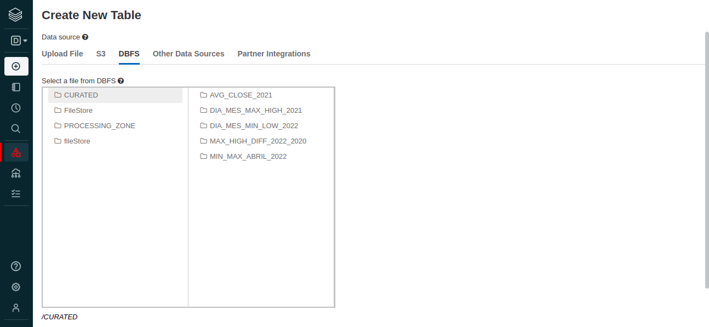

Este projeto se trata de um simples etl com um dataset com as variações dos preços diários do bitcoin. Os códigos do notebook foram desenvolvidos tanto em pyspark quanto em sql, numa simulação de solucão referentes a perguntas de négocio:

- 1 - Qual foi o maior valor do bitcoin no mês de Abril de 2022? E o menor?
- 2 - Qual a média do valor do fechamento do bitcoin no ano de 2021 em relação aos dados trabalhados?
- 3 - Qual foi o dia e o mês apenas do ano de 2021 que o bitcoin teve sua maior alta?
- 4 - Qual foi o dia e o mês apenas do ano de 2022 que o bitcoin teve sua maior baixa?
- 5 - Qual foi a diferença entre o maior valor de bitcoin do ano de 2022 e o maior ano de 2020?

O dado pode ser encontrado [aqui](data/Binance_BTCBRL_d.csv). Quanto a lógica, primeiramente o dado foi convertido da zona landing, onde mantém o seu estado original em csv para a zona processing, em parquet para ganharmos otimização, performance e compressão de volume do dado. 

```python 
# Lendo o dado na sua forma bruta.

file_location = "/FileStore/tables/Binance_BTCBRL_d.csv"

df = (
    spark
    .read
    .format("csv")
    .option("InferSchema", True)
    .option("header", True)
    .option("quote", "'")
    .option("sep", ",")
    .load(file_location)
)

display(df)

# Escrevendo o dados no formato parquet na segunda camada do datalake.

file_location2 = "/PROCESSING_ZONE/Binance_file"

(
    df
    .write
    .mode("overwrite")
    .format("parquet")
    .save(file_location2)
)    
```

Após foi feita a leitura no parquet salvo na etapa anterior e uma tratativa de enriquecimento e melhoria na tipagem dos dados, além da criação de um view para também realizarmos manipulações em SQL.

```python
# Lendo o dado de uma das zonas do datalake.

file_location3 = "/PROCESSING_ZONE/Binance_file"

df1 = (
    spark
    .read
    .format("parquet")
    .load(file_location3)
)

display(df1)

from pyspark.sql.types import DecimalType
from pyspark.sql.functions import to_date, col, year, month, dayofmonth

df1 = (
    df1.withColumnRenamed('date', 'date'.upper())
        .withColumnRenamed('symbol', 'symbol'.upper())
        .withColumnRenamed('open', 'open'.upper())
        .withColumnRenamed('high', 'high'.upper())
        .withColumnRenamed('low', 'low'.upper())
        .withColumnRenamed('close', 'close'.upper()) 
        .withColumnRenamed('Volume BTC', 'Volume_BTC'.upper())
        .withColumnRenamed('Volume BRL', 'Volume_BRL'.upper())
        .withColumnRenamed('tradecount', 'trade_count'.upper())
        .withColumn('DATE', to_date('DATE'))
        .withColumn('OPEN', col('OPEN').cast(DecimalType(10, 2)))
        .withColumn('HIGH', col('HIGH').cast(DecimalType(10, 2)))
        .withColumn('LOW', col('LOW').cast(DecimalType(10, 2)))
        .withColumn('CLOSE', col('CLOSE').cast(DecimalType(10, 2)))
        .withColumn('VOLUME_BRL', col('VOLUME_BRL').cast(DecimalType(10, 2)))
        .withColumn('ANO', year('DATE'))
        .withColumn('MES', month('DATE'))
        .withColumn('DIA', dayofmonth('DATE'))
        .select('DATE', 'SYMBOL', 'OPEN', 'CLOSE', 'LOW', 'HIGH', 'VOLUME_BTC', 'VOLUME_BRL', 'TRADE_COUNT', 'ANO', 'MES', 'DIA')
)

display(df1)


# Criando uma view para trabalhar com PySpark e SQL respondendo algumas perguntas de negócios.

df1.createOrReplaceTempView('df1')

```

E para finalizar, foram respondidas as questões:

```md
1 - Qual foi o maior valor do bitcoin no mês de Abril de 2022? E o menor?
```

```python

from pyspark.sql.functions import max, min 

df1_new = ( 
            df1.where("MES == '4'")
             .groupBy("MES")
             .agg(max("HIGH").alias("MAX_VALUE_ABRIL_2022"), min("HIGH").alias("MIN_VALUE_ABRIL_2022"))
)

display(df1_new)

(
    df1_new
    .write
    .mode("overwrite")
    .format("parquet")
    .save("/CURATED/MIN_MAX_ABRIL_2022")
)
```

```sql

%sql 

SELECT 
      MES,
      MAX(HIGH) AS MAX_VALUE_ABRIL_2022,
      MIN(HIGH) AS MIN_VALUE_ABRIL_2022
FROM 
      df1
WHERE 
      MES = 4 
GROUP BY 
      MES
```

```md 
2 - Qual a média do valor do fechamento do bitcoin no ano de 2021 em relação aos dados trabalhados?
```

```python
from pyspark.sql.functions import avg, col
from pyspark.sql.types import DecimalType

df2_new = ( 
            df1.where("ANO == '2021'")
             .groupBy("ANO")
             .agg(avg("CLOSE"))
             .withColumn("avg(CLOSE)",col("avg(CLOSE)").cast(DecimalType(10, 2)))
             .withColumnRenamed("avg(CLOSE)", "MEAN_CLOSE_2021")
)

display(df2_new)

(
    df2_new
    .write
    .mode("overwrite")
    .format("parquet")
    .save("/CURATED/AVG_CLOSE_2021")
)
```

```sql
%sql 

SELECT 
     ANO,
     CAST(AVG(CLOSE) AS DECIMAL(10, 2)) AS MEAN_CLOSE_2021
FROM 
      df1
WHERE 
      ANO = 2021
GROUP BY 
      ANO  
```

```md
3 - Qual foi o dia e o mês apenas do ano de 2021 que o bitcoin teve sua maior alta?
```

```python
from pyspark.sql.functions import max 


df3_new = (
            df1.where("ANO == '2021'")
            .groupBy("MES", "DIA")
            .agg(max("HIGH").alias("MAX_HIGH"))
            .orderBy("MAX_HIGH", ascending = False)
            .limit(1)
            .select("DIA", "MES")

)

display(df3_new)

(
    df3_new
    .write
    .mode("overwrite")
    .format("parquet")
    .save("/CURATED/DIA_MES_MAX_HIGH_2021")
)
```

```sql
%sql 

WITH tmp as (
  SELECT 
        DIA,
        MES,
        MAX(HIGH) as max_tmp
  FROM df1
  WHERE ANO = 2021 
  GROUP BY DIA, MES
  ORDER BY max_tmp DESC
  LIMIT(1)
)

SELECT 
     DIA, MES
FROM tmp
```

```md 
4 - Qual foi o dia e o mês apenas do ano de 2022 que o bitcoin teve sua maior baixa?
```

```python
from pyspark.sql.functions import min


df4_new = (
            df1.where("ANO == '2022'")
            .groupBy("MES", "DIA")
            .agg(min("LOW").alias("MIN_LOW"))
            .orderBy("MIN_LOW", ascending = False)
            .limit(1)
            .select("DIA", "MES")

)

display(df4_new)

(
    df4_new
    .write
    .mode("overwrite")
    .format("parquet")
    .save("/CURATED/DIA_MES_MIN_LOW_2022")
)
```

```sql
%sql 

WITH tmp as (
  SELECT 
        DIA,
        MES,
        MIN(LOW) as min_tmp
  FROM df1
  WHERE ANO = 2022 
  GROUP BY DIA, MES
  ORDER BY min_tmp DESC
  LIMIT(1)
)

SELECT 
     DIA, MES
FROM tmp
```

```md
5 - Qual foi a diferença entre o maior valor de bitcoin do ano de 2022 e o maior ano de 2020?
```

```python
from pyspark.sql.functions import max, min, col

df5_new = (
        df1.where("ANO != '2021'")
        .groupBy("ANO")
        .agg(max("HIGH").alias("MAX_PER_YEAR"))
        .orderBy("ANO")
        .agg(max("MAX_PER_YEAR").alias("MAX_PER_YEAR_2022"), min("MAX_PER_YEAR").alias("MAX_PER_YEAR_2020"))
        .withColumn("DIFF", col("MAX_PER_YEAR_2022") - col("MAX_PER_YEAR_2020"))
        .select("DIFF")

)

display(df5_new)


(
    df5_new
    .write
    .mode("overwrite")
    .format("parquet")
    .save("/CURATED/MAX_HIGH_DIFF_2022_2020")
)
```

```sql
%sql

with ano_2022 as (
    SELECT 
          MAX(HIGH) AS MAX_2022
    FROM 
          df1 
    WHERE 
          ANO = 2022
), 

ano_2020 as (
    SELECT 
          MAX(HIGH) AS MAX_2020
    FROM 
          df1 
    WHERE 
          ANO = 2020

)

SELECT 
    (a.MAX_2022 - b.MAX_2020) as DIFF
FROM 
    ano_2022 a
CROSS JOIN 
    ano_2020 b
```

Segue abaixo os resultados das manipulações salvos: 



Espero que gostem, se tiverem dúvidas entrem em contato pelo [LinkedIn](https://www.linkedin.com/in/victor-andrade-1802b11ba/)


